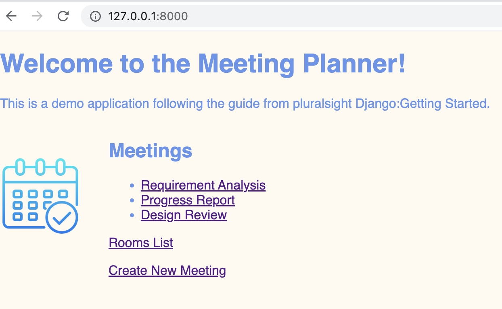
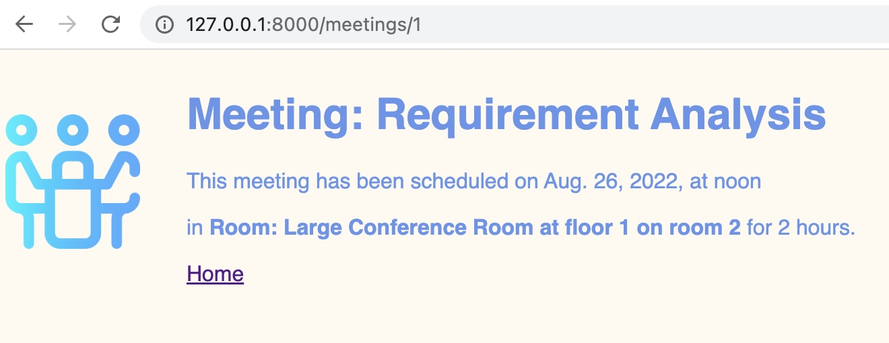
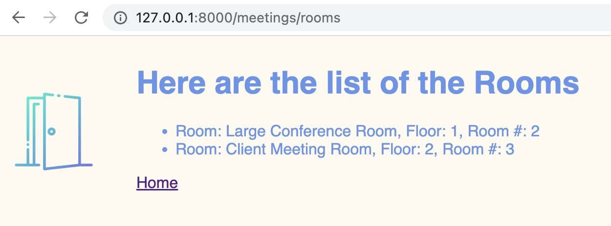
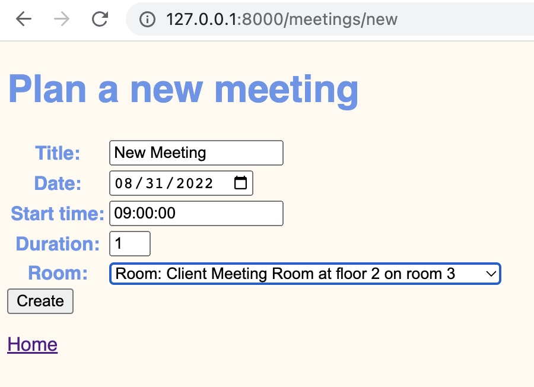

# Django Sample Meeting Planner App

Meeting Planner App

Created a meeting planner application where the user can view the list of meetings and its details as well as the rooms available.

The user can also create a new meeting with the form which has some validation.

template inheritance, static files, etc. were used in this app.

Here are the sample screenshots:

guide source:

https://www.pluralsight.com/courses/django-getting-started

### Part 1

##### Starting a Django Project

created website app

add website to INSTALLED_APPS

added some simple views in website

mapped views to meeting_planner urls

### Part 2

##### Creating simple web page

created meetings app

add meetings to INSTALLED_APPS

created Meeting class with title, date, start, duration in meeting.models

added admin.site.register(Meeting) in meetings.admin

added __self__ in Meeting class (for admin view)

`python manage.py makemigrations`

`python manage.py migrate`

`python manage.py createsuperuser`

### Part 3

##### Setting up a Data Model

created Room class with name, floor, room number in meetings.model

add room object foreign key in Meetings class

added admin.site.register(Room) in meetings.admin

added __self__ in Meeting class (for admin view)

cleaned db and migrations

`python manage.py makemigrations`

`python manage.py migrate`

`python manage.py createsuperuser`

### Part 4

##### Combining Model, View, and Template

added templates folder for the html files of the website app

added templates folder for the html files of the meetings app

updated views for the template html files

added urlpatterns

get_object_or_404 for meeting detail view

### Part 5

##### Urls and Link Building

meetings app link building

added meetings.urls and urlpatterns

modified meeting planner urlpatterns path for meetings.urls

added rooms list template

modified welcome template

used template variables and loops in template

### Part 6

##### Templates, Styling, and Static Content

created static content for meeting app

applying CSS to welcome page

template inheritance

modified htmls to inherit base - modified to only retain only content

added images for the pages

### Part 7

##### Add UserInteraction witn ModelForms

added form so that user can create new meeting

create new html, created view.new, added in urlpatterns

added validation in form

